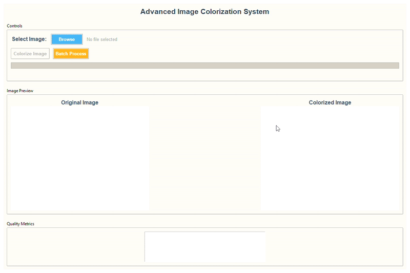

# Advanced Image Colorization System
## Deep Learning Academic Project



## Project Overview

This project implements an advanced deep learning-based image colorization system that converts black and white images to color images using state-of-the-art neural network techniques. The system leverages the Lab color space and a pre-trained Caffe model to achieve high-quality colorization results.

### Key Features

- **Deep Learning-Based Colorization**: Uses a pre-trained Caffe neural network model
- **Lab Color Space Processing**: Optimized for grayscale to color conversion
- **Modern GUI Interface**: Professional graphical user interface with real-time feedback
- **Batch Processing**: Process multiple images simultaneously
- **Quality Metrics**: Comprehensive evaluation of colorization quality
- **Error Handling**: Robust error handling and logging system
- **Performance Optimization**: Efficient image processing pipeline

## Technical Architecture

### Color Space Theory

The system operates in the Lab color space, which consists of three channels:
- **L channel**: Represents lightness (grayscale information)
- **a channel**: Represents green-red color information
- **b channel**: Represents blue-yellow color information

This color space is particularly suitable for colorization because the grayscale information is encoded only in the L channel, while color information is contained in the a and b channels.

### Neural Network Architecture

The system uses a pre-trained Caffe model with the following characteristics:
- **Input**: L channel (lightness) of the image
- **Output**: a and b channels (color information)
- **Training Data**: ImageNet dataset
- **Model Type**: Deep Convolutional Neural Network

### Processing Pipeline

1. **Image Loading**: Load input grayscale image
2. **Color Space Conversion**: Convert to Lab color space
3. **L Channel Extraction**: Extract lightness channel
4. **Neural Network Processing**: Predict a and b channels
5. **Channel Combination**: Combine L, a, and b channels
6. **Color Space Conversion**: Convert back to RGB/BGR
7. **Output Generation**: Save colorized image

## Installation

### Prerequisites

- Python 3.8 or higher
- OpenCV 4.8+
- NumPy 1.24+
- Matplotlib 3.7+
- Pillow 10.0+
- scikit-image 0.21+

### Setup Instructions

1. **Clone the repository**:
   ```bash
   git clone <repository-url>
   cd Colorize-Black-White-Image-main
   ```

2. **Install dependencies**:
   ```bash
   pip install -r requirements.txt
   ```

3. **Download model files** (if not already present):
   ```bash
   # The model files should already be included in the repository
   # If missing, download them manually:
   # - colorization_release_v2.caffemodel
   # - colorization_deploy_v2.prototxt
   # - pts_in_hull.npy
   ```

## Usage

### Command Line Interface

#### Basic Usage
```bash
python src/colorizer.py
```

#### Batch Processing
```python
from src.colorizer import ImageColorizer

# Initialize colorizer
colorizer = ImageColorizer()

# Process single image
image = cv.imread("input.jpg")
colorized = colorizer.colorize_image(image)
cv.imwrite("output.png", colorized)

# Batch processing
image_paths = ["image1.jpg", "image2.jpg", "image3.jpg"]
results = colorizer.batch_colorize(image_paths, "./output")
```

### Graphical User Interface

Launch the modern GUI:
```bash
python src/gui.py
```

**GUI Features**:
- Drag and drop image selection
- Real-time processing feedback
- Before/after image comparison
- Quality metrics display
- Batch processing capabilities
- Professional styling

### API Usage

```python
from src.colorizer import ImageColorizer
import cv2 as cv

# Initialize the colorizer
colorizer = ImageColorizer()

# Load and process an image
image = cv.imread("black_white_image.jpg")
colorized_image = colorizer.colorize_image(image)

# Save the result
cv.imwrite("colorized_image.png", colorized_image)

# Evaluate quality
metrics = colorizer.evaluate_colorization(image, colorized_image)
print(f"SSIM: {metrics['ssim']:.4f}")
print(f"PSNR: {metrics['psnr']:.2f} dB")
print(f"Colorfulness: {metrics['colorfulness']:.2f}")

# Create comparison plot
colorizer.create_comparison_plot(image, colorized_image, "comparison.png")
```

## Project Structure

```
Colorize-Black-White-Image-main/
├── src/
│   ├── __init__.py
│   ├── colorizer.py          # Core colorization engine
│   └── gui.py               # Modern GUI interface
├── models/
│   ├── colorization_deploy_v2.prototxt
│   └── colorization_release_v2.caffemodel
├── output/                  # Generated colorized images
├── requirements.txt         # Python dependencies
├── README.md              # This file
└── Animation.gif          # Demo animation
```

## Performance Metrics

The system evaluates colorization quality using multiple metrics:

### Structural Similarity Index (SSIM)
- **Range**: 0 to 1 (higher is better)
- **Purpose**: Measures structural similarity between original and colorized images
- **Interpretation**: Values above 0.9 indicate excellent quality

### Peak Signal-to-Noise Ratio (PSNR)
- **Range**: Typically 20-40 dB (higher is better)
- **Purpose**: Measures image quality and noise levels
- **Interpretation**: Values above 30 dB indicate good quality

### Colorfulness Score
- **Range**: Varies based on image content
- **Purpose**: Measures the vibrancy and color richness
- **Interpretation**: Higher values indicate more vibrant colors

## Technical Implementation Details

### Model Architecture
- **Framework**: Caffe Deep Learning Framework
- **Architecture**: Convolutional Neural Network
- **Input Size**: 224x224 pixels
- **Color Space**: Lab (Lightness, a, b channels)
- **Training Data**: ImageNet dataset

### Preprocessing Pipeline
1. **Image Resizing**: Resize to 224x224 for network input
2. **Color Space Conversion**: RGB → Lab
3. **Channel Extraction**: Extract L channel
4. **Normalization**: Center L channel values
5. **Blob Creation**: Prepare input for neural network

### Post-processing Pipeline
1. **Channel Combination**: Combine predicted a,b with original L
2. **Color Space Conversion**: Lab → RGB/BGR
3. **Value Clipping**: Ensure values in valid range [0, 255]
4. **Image Resizing**: Resize to original dimensions

## Academic Contributions

This project demonstrates several important concepts in computer vision and deep learning:

### Computer Vision Concepts
- **Color Space Theory**: Understanding of RGB, Lab, and grayscale color spaces
- **Image Processing**: Preprocessing and post-processing techniques
- **Feature Extraction**: Channel-based feature extraction
- **Quality Assessment**: Multiple evaluation metrics

### Deep Learning Concepts
- **Transfer Learning**: Using pre-trained models
- **Neural Network Architecture**: Understanding CNN structure
- **Model Deployment**: Practical application of trained models
- **Performance Optimization**: Efficient inference pipeline

### Software Engineering Concepts
- **Modular Design**: Separated concerns and reusable components
- **Error Handling**: Robust error management and logging
- **User Interface Design**: Professional GUI development
- **Documentation**: Comprehensive code and project documentation

## Future Enhancements

### Potential Improvements
1. **Real-time Processing**: GPU acceleration for faster processing
2. **Multiple Models**: Support for different colorization models
3. **Video Processing**: Extend to video colorization
4. **Web Interface**: Deploy as web application
5. **Mobile App**: Develop mobile application
6. **Custom Training**: Train models on specific datasets

### Research Directions
1. **GAN-based Colorization**: Implement Generative Adversarial Networks
2. **Attention Mechanisms**: Add attention layers for better results
3. **Multi-scale Processing**: Process images at multiple scales
4. **Style Transfer**: Incorporate artistic style transfer
5. **Interactive Colorization**: User-guided colorization

## Troubleshooting

### Common Issues

1. **Model Loading Error**:
   - Ensure all model files are present in the `models/` directory
   - Check file permissions and paths

2. **Memory Issues**:
   - Reduce image size for processing
   - Close other applications to free memory

3. **GUI Not Loading**:
   - Verify tkinter is installed
   - Check Python version compatibility

4. **Poor Colorization Quality**:
   - Ensure input image is properly grayscale
   - Check image resolution and quality
   - Verify preprocessing pipeline

### Performance Tips

1. **GPU Acceleration**: Install CUDA-enabled OpenCV for faster processing
2. **Batch Processing**: Use batch processing for multiple images
3. **Image Optimization**: Pre-resize large images before processing
4. **Memory Management**: Process images sequentially for large batches

## License

This project is licensed under the MIT License - see the LICENSE file for details.

## Acknowledgments

- **Original Model**: Based on the colorization model by Zhang et al.
- **OpenCV**: Computer vision library for image processing
- **Caffe**: Deep learning framework for model inference
- **Academic Community**: Research papers and implementations that inspired this work

## Contact

For questions, issues, or contributions, please contact:
- **Author**: [Your Name]
- **Institution**: [Your College]
- **Email**: [your.email@college.edu]

---

**Note**: This project is designed for academic purposes and demonstrates advanced concepts in computer vision and deep learning. The implementation includes professional-grade features suitable for resume presentation and academic evaluation.

## Interview Q&A

**Q: Why use the Lab color space for colorization?**  
A: Lab separates luminance (L) from color (a, b), making it easier to predict color information from grayscale input.

**Q: What does the neural network predict?**  
A: It predicts the a and b color channels given the L (grayscale) channel.

**Q: How do you evaluate colorization quality?**  
A: Using SSIM (structural similarity), PSNR (signal-to-noise), and a colorfulness metric.

**Q: How is batch processing implemented?**  
A: By iterating over a list of image paths, colorizing each, and saving results with error handling.

**Q: How do you handle missing or corrupt files?**  
A: The code checks for file existence and validity, and logs errors without crashing the batch.

**Q: What are the main software engineering best practices you followed?**  
A: Modular code, clear documentation, error handling, logging, requirements management, and a professional project structure.
